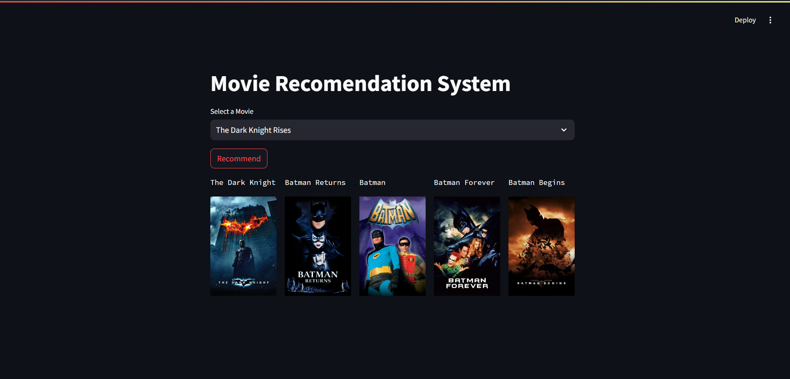

# Movie Recommendation System

This repository contains a movie recommendation system developed using Machine Learning with cosine similarity to suggest related movies. The project utilizes the TMDB dataset and includes extensive exploratory data analysis (EDA) and data cleaning.

## Overview

The movie recommendation system is designed to help users find movies similar to their preferences based on cosine similarity. By leveraging the TMDB dataset, we can provide meaningful and accurate movie recommendations.

## Features

- **Movie Recommendations**: Suggests movies similar to a given movie using cosine similarity.
- **Extensive EDA**: Detailed exploratory data analysis to understand the dataset better.
- **Data Cleaning**: Preprocessing steps to ensure data quality and consistency.

## Dataset

The project uses the TMDB dataset, which includes a wide range of movies with various attributes such as titles, genres, release dates, ratings, and more.

## Tools and Libraries

- **Pandas**: For efficient data handling and manipulation.
- **NumPy**: For numerical operations and data processing.
- **Scikit-Learn**: For implementing cosine similarity and other machine learning algorithms.
- **Streamlit**: For creating the web interface.

## Exploratory Data Analysis

The `notebooks` directory contains Jupyter notebooks that provide detailed exploratory data analysis (EDA) of the TMDB dataset. These notebooks cover various aspects such as:

- Data distribution 
- Missing value analysis and handling
- Feature engineering and selection

## Data Cleaning

Data cleaning steps include:

- Removing duplicates
- Handling missing values
- Converting data types
- Normalizing text fields

## Machine Learning

The recommendation system uses cosine similarity to find and suggest movies that are similar to a given movie. Cosine similarity is computed based on various features extracted from the dataset.

# Screenshot

## Acknowledgments

- The dataset used in this project is sourced from [TMDB](https://www.themoviedb.org/).
- This project was inspired by various open-source movie recommendation systems.

